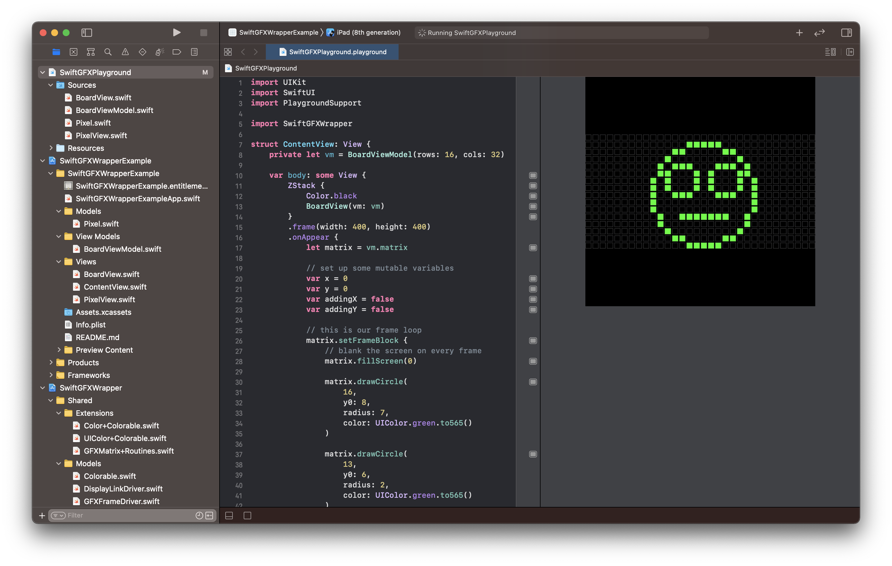

# SwiftGFXWrapper

## What is this?

This is a Swift -> Objective C -> C / C++ wrapper around the [Adafruit GFX library](https://github.com/adafruit/Adafruit-GFX-Library) meant to be ran in an iOS / macOS / watchOS environment.

## Why would you use it?

- Prototyping for a device that runs the Adafruit GFX library (e.g. a NeoMatrix)
- Generating the pixel buffer for a device that you want to push to
- [Playing with pixel graphics](https://github.com/twstokes/flipdots-ios) in an iOS / macOS / watchOS environment

## Getting started

### Initialize Git submodules
Install the Adafruit GFX library by running: `git submodule update --init`

A Swift Playground and an example project are included in this library to get started. SwiftUI is optional. Anything that can observe changes to pixels will work. `GFXMatrix` can be subclassed to fit your needs.

## Basic Usage

After initializing a `GFXMatrix`, you should be able to use it similarly to the Adafruit GFX library. The most important pieces are:

- `.setDrawCallback` - this is the closure that's called for every pixel being drawn
- `.setFrameBlock` - this is the closure that's ran on every "step" (equivalent to the `loop()` Arduino function)

The example code covers:

1. Setting up a pixel buffer
2. Initializing a matrix and setting the draw callback function
3. Initializing a driver to run the step function on the matrix
4. Calling a graphics routine that sets the frame block

## Supported platforms

- iOS 14.1+
- macOS 11+
- watchOS 7.2+

### Carthage installation

Add this to your Cartfile: `github "twstokes/swift-gfx-wrapper"`
